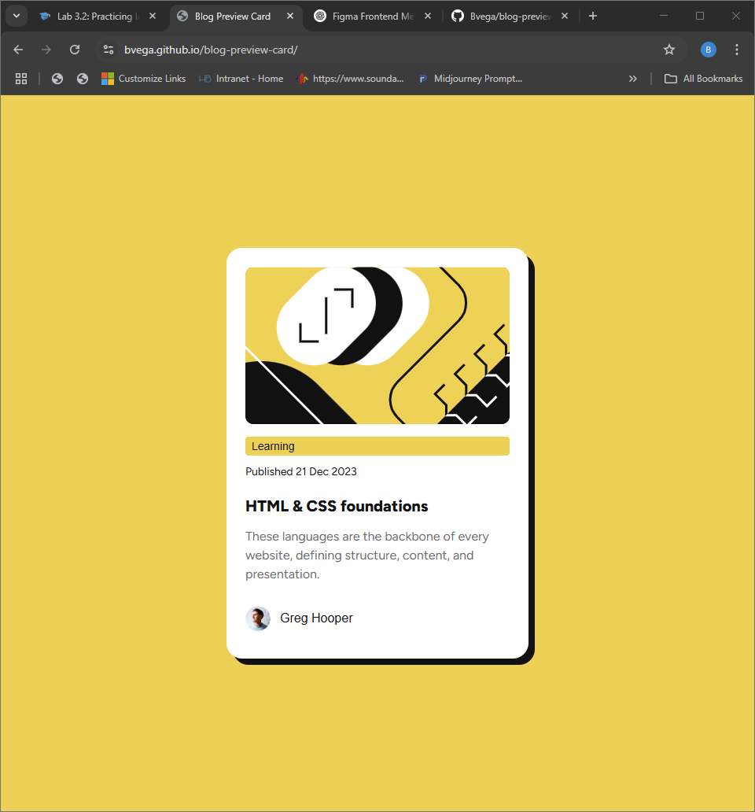
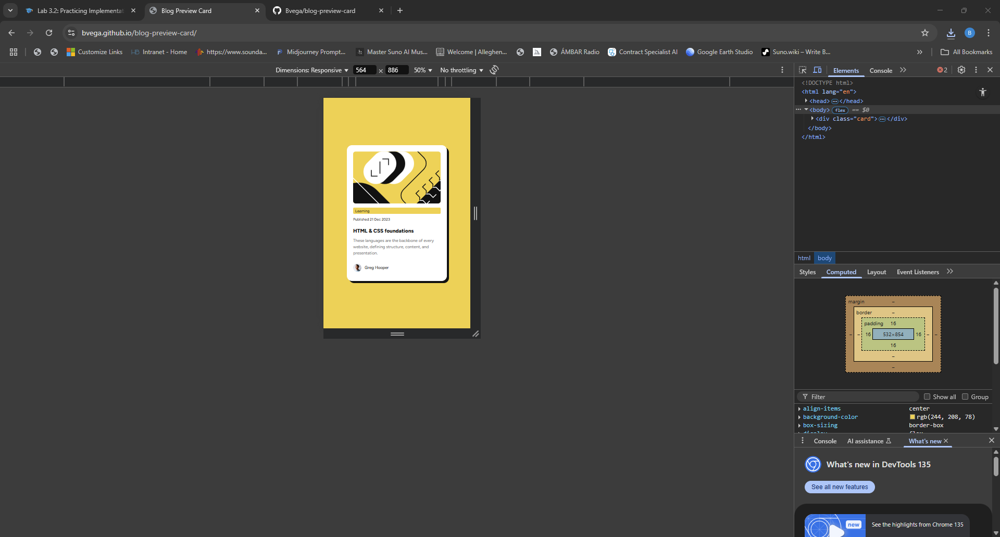

# Frontend Mentor - Blog Preview Card Solution

This is a solution to the [Blog preview card challenge on Frontend Mentor](https://www.frontendmentor.io/challenges/blog-preview-card-ckPaj01IcS).

## Table of Contents

- [Overview](#overview)  
- [Screenshot](#screenshot)  
- [Links](#links)  
- [My Process](#my-process)  
  - [Built With](#built-with)  
  - [What I Learned](#what-i-learned)  
  - [Continued Development](#continued-development)  
  - [Useful Resources](#useful-resources)  
- [Reflection](#reflection)  
- [Author](#author)  
- [Acknowledgments](#acknowledgments)  

## Overview

### The Challenge

Users should be able to:

- See hover and focus states for all interactive elements on the page.  
- View a blog preview card that matches the provided designs at **384 × 522 px**, with correct typography, spacing, and shadow effects.  

## Screenshot

**Desktop Preview**  

**Mobile Preview**  

_(Place these files in your repo root or an `/images` folder.)_

## Links

- **Solution URL:** [https://github.com/Bvega/blog-preview-card](https://github.com/Bvega/blog-preview-card)  
- **Live Site URL:** [https://bvega.github.io/blog-preview-card/](https://bvega.github.io/blog-preview-card/)  

## My Process

### Built With

- Semantic HTML5 markup  
- CSS custom properties for theming  
- Flexbox for layout  
- Mobile-first workflow  
- Local `@font-face` integration of the Figtree variable font  

### What I Learned

- How to load and use variable fonts via `@font-face`.  
- Creating crisp, offset shadows with `box-shadow`.  
- Maintaining a consistent design system using CSS variables.  
- Building responsive components that adapt from mobile to desktop.  
- Enhancing accessibility with clear focus states on interactive elements.  

### Continued Development

- Add keyboard navigation support for the card.  
- Implement a dark mode toggle using CSS variables.  
- Experiment with CSS Grid for alternate layouts.  
- Automate visual testing with Puppeteer or Playwright.  

### Useful Resources

- [Frontend Mentor Blog Preview Card Challenge](https://www.frontendmentor.io/challenges/blog-preview-card-ckPaj01IcS) – Original brief.  
- [MDN: Using CSS Custom Properties](https://developer.mozilla.org/en-US/docs/Web/CSS/Using_CSS_custom_properties) – Guide to CSS variables.  
- [CSS-Tricks: A Complete Guide to Flexbox](https://css-tricks.com/snippets/css/a-guide-to-flexbox/) – Flexbox reference.  
- [MDN: @font-face](https://developer.mozilla.org/en-US/docs/Web/CSS/@font-face) – Custom font integration.  

## Reflection

1. **What I’m most proud of, and what I’d do differently next time**  
   I’m proud of achieving a pixel-perfect match to the Figma designs—including exact sizing, spacing, and the crisp offset shadow. Next time, I’d streamline the workflow by automating screenshot exports and explore CSS Grid for layout flexibility.

2. **Challenges I encountered and how I overcame them**  
   - **Variable font integration:** Loading Figtree weights via `@font-face` required testing static fallbacks alongside the variable font in multiple browsers.  
   - **Box-shadow precision:** Reproducing the exact 8 px offset, 0 px blur shadow meant iterating with Figma’s inspector and tweaking CSS until it aligned.  
   - **Keyboard accessibility:** Ensuring the title link had a clear focus outline involved adding custom `:focus` styles and testing with the Tab key.

3. **Areas I’d like help with**  
   - Implementing a **dark mode** toggle driven by CSS variables.  
   - Setting up **visual regression tests** (e.g. with Storybook or Playwright).  
   - Enhancing overall **accessibility**, such as ARIA roles and advanced focus management.

## Author

**Bolivar Vega**  
- GitHub: [@Bvega](https://github.com/Bvega)  
- Frontend Mentor: [@Bvega](https://www.frontendmentor.io/profile/Bvega)  

## Acknowledgments

Thanks to the Frontend Mentor community for feedback and inspiration. Built with guidance from the challenge’s example designs.  
